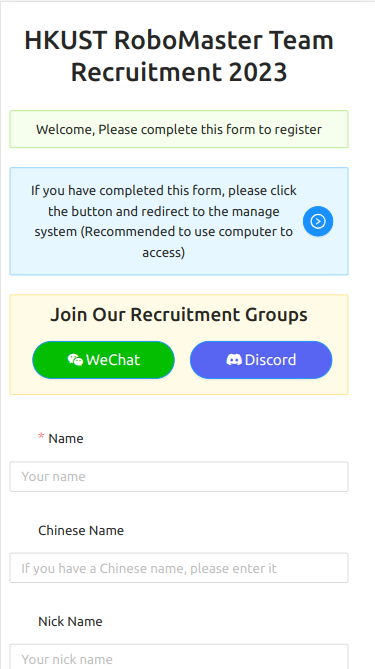
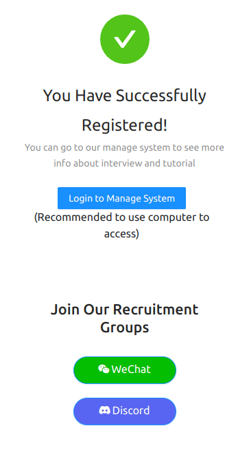
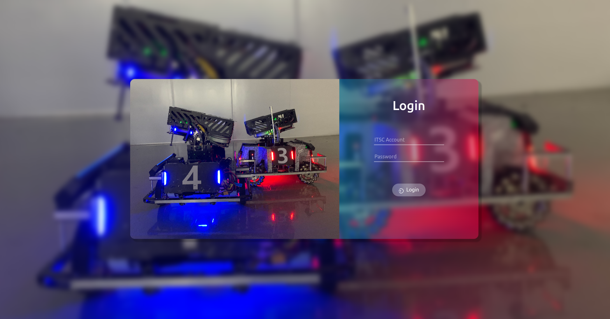
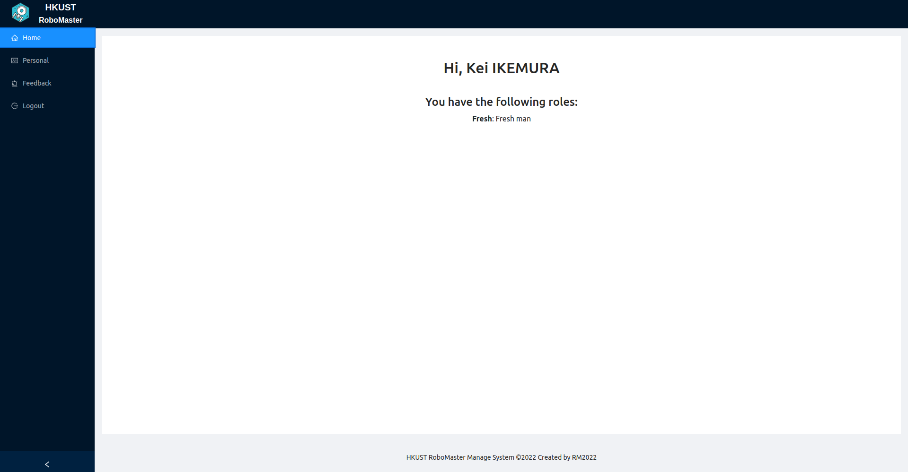
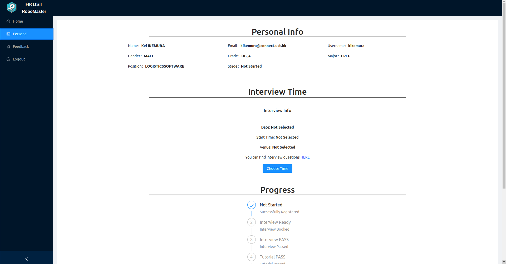
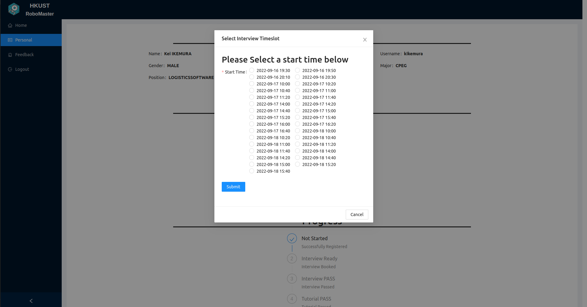
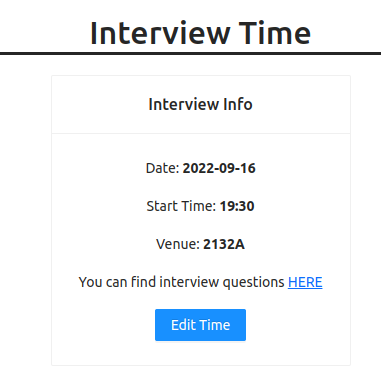

# How to use our register system

## 1. Register 
  
Click on [this link](http://laojk.club/register) and fill the table. Please note that your ITSC account (ITSC email without "@connect.ust.hk") will be your username.   
## 2. Go to the manage system
  
After successfully registered, you may login to our manage system by [this link](http://laojk.club/login)  
**Highly recommed you to login with a desktop or pad, the page may not be friendly to phone users. Sorry for inconvenience caused.**
## 3. Login

Remember that your ITSC account is your username (**without @connect.ust.hk**). If you forgot your password, please find our seniors for help or contact the [web developer](mailto:jzhanger@connect.ust.hk) directly.
## 4. Check your personal info (optinal)
  
At home page, you can check your roles. For newly enrolled members, your role is **Fresh man**. 
   
At personal page, you can check your personal info, interview info and progress. You can also change your password here.  
## 5. Select an interview time
  
In the personal page, you need to select your interview section. And you can change it before your interview. Also, the interview question is given in this page.  
  
Remember to check your time and venue again after you book the timeslot. A confirm email will also be sent to your ITSC mail box.

## Contact
If you encounter any problem using the system, please reach us directly. You can ask in the Discord/Wechat group or email to our [team account](mailto:robomasterhkust@gmail.com) or email to the [web developer](mailto:jzhanger@connect.ust.hk) directly. 